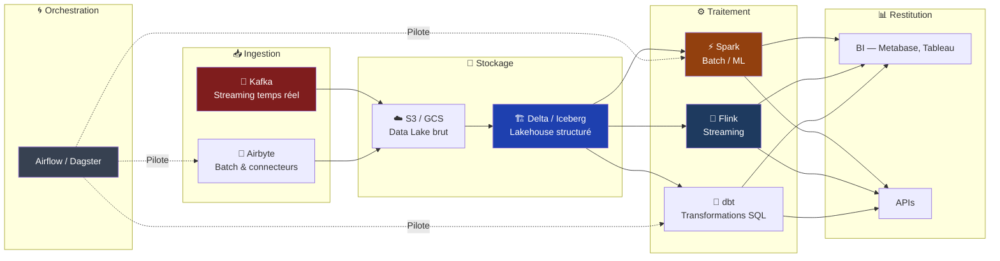

# Tableau de synthèse — quel outil pour quel besoin ?

```mermaid
graph LR
    subgraph "📥 Ingestion"
        K["📨 Kafka\nStreaming temps réel"]
        A["🔌 Airbyte\nBatch & connecteurs"]
    end
    subgraph "💾 Stockage"
        S3["☁️ S3 / GCS\nData Lake brut"]
        DL["🏗️ Delta / Iceberg\nLakehouse structuré"]
    end
    subgraph "⚙️ Traitement"
        SP["⚡ Spark\nBatch / ML"]
        FL["🌊 Flink\nStreaming"]
        DBT["🔧 dbt\nTransformations SQL"]
    end
    subgraph "🌀 Orchestration"
        AF["Airflow / Dagster"]
    end
    subgraph "📊 Restitution"
        BI["BI — Metabase, Tableau"]
        API["APIs"]
    end

    K --> S3
    A --> S3
    S3 --> DL
    DL --> SP & FL & DBT
    SP & FL & DBT --> BI & API
    AF -.->|"Pilote"| SP & DBT & A

    style K fill:#7f1d1d,color:#fff
    style SP fill:#92400e,color:#fff
    style FL fill:#1e3a5f,color:#fff
    style DL fill:#1e40af,color:#fff
    style AF fill:#374151,color:#fff
```